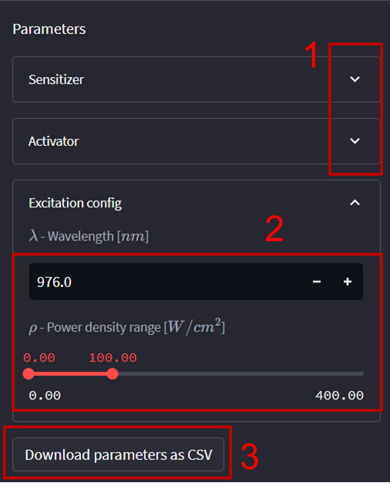
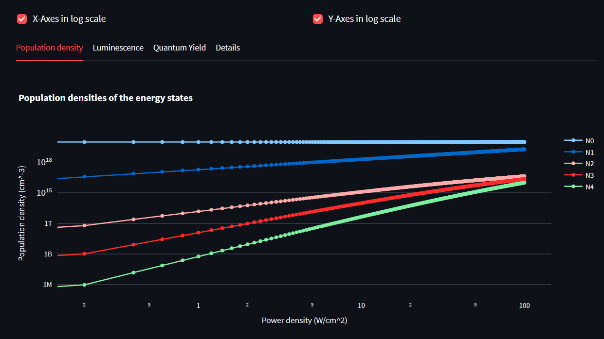
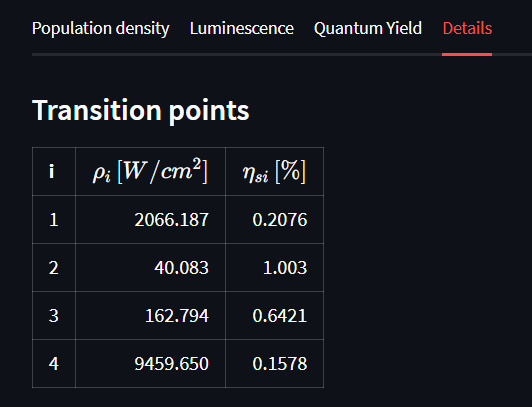
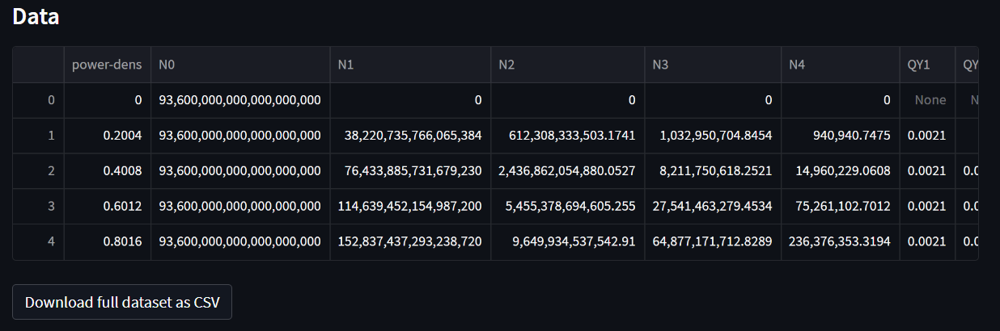

# Virtual Lab APP for Upconversion

The deployed stable version of this app can be accessed [here](https://jsmatias-qy-virtuallabapp-home-ch3fhq.streamlit.app/).
It refers to the main branch of my personal GitHub repository [https://github.com/jsmatias/QY-VirtualLabAPP](https://github.com/jsmatias/QY-VirtualLabAPP).

## Description

Welcome to our Virtual lab for Upconversion (UC).
Our app is based on a simple general analytical model that introduces
the concept of transition power density points and QY saturation to characterise the internal Quantum Yield (iQY)
of an UC process originated from an arbitrary j state.
This model is particularly useful for understanding the non-linear power density dependence present in upconverting systems, such as
Upconverting Nanoparticle (UCNPs), which are important for several applications, such as living tissue imaging and super-resolution microscopy.

The general analytical model was derived from a set of rate equation that comprises energy transfer, $W_j$, and linear decay rates, $R_j$, of the electronic
states of sensitizer-activator pair involved in the process called energy transfer upconversion (ETU).
Please check our scientific paper for more details regarding it ([Link to be placed here], DOI:).

Our app allows users to interactively explore the behaviour of the iQY of a upconverting system (a two-level sensitizer coupled to a four-level activator)
under different excitation power densities. Users can change the values of the input parameters of the model and see the
corresponding iQY values and UC luminescence and population densities graphs on the screen.
The app is capable of simulating ETU processes with order higher than two, which has not been widely studied in the literature up to the publishing date
of the paper.

We believe that our web app will be a valuable tool for researchers and scientists interested in studying UCNPs
and the understanding of their behaviour under different excitation conditions.
We hope you find our app useful and informative, and we welcome any feedback or suggestions for improvement.

---

## Usage

To explore the simulation, simply navigate to the "Simulation" tab in the sidebar on the left.
From there, you can adjust the input parameters and observe how they influence the population densities of the energy states,
which in turn affect the UC luminescence and iQY results.

Use the slider to adjust the excitation power density and input boxes to change the decay and energy transfer rates
of the energy levels involved in the UC process.

As you change the parameters, the simulation will automatically update the population densities and the resulting luminescence and iQY values.
You can also observe the changes in real-time on the corresponding graphs.

At the "Details" tab you can find the calculated transitions points and the iQY saturation levels.

In the "Details" tab you can also download the generated data corresponding to the input parameters as a CSV file.

By exploring the simulation, you can gain insights into the behaviour of upconverting materials under different excitation conditions
and better understand the relationship between the input parameters and the resulting luminescence and iQY values.

---

## Installation

This app was develop in Python along Streamlit, a framework for data science.
For the installation to run locally, we recommend to create a virtual environment before running Streamlit.
Check the Streamlit documentation for more information.

---

## File structure

- `imgs/`: This directory contains images for this README.md file
- `pages`: It has the files to render the pages of the app.
- `src`: This folder has the main functions responsible for simulating and displaying data.

---

## Contributing

We believe that collaborative development is the key to improvement, and we welcome any contributions you may have to offer.
To get started, please take a look at our issue tracker to see if there are any tasks that you're interested in tackling.
If you have an idea for a new feature or improvement, please feel free to open a new issue so that we can discuss it.

Before making a pull request, please make sure that your code follows our code style guidelines and that all tests pass successfully.
We appreciate well-documented code and encourage you to write clear, concise comments that will help others understand your contributions.

---

## Licence and citation

The source code of this project is publicly available on GitHub [https://github.com/jsmatias/QY-VirtualLabAPP](https://github.com/jsmatias/QY-VirtualLabAPP).
This app is licensed under the MIT License, which allows for unrestricted use, distribution, and modification of the software.
If you use this app in your research or other work, we kindly ask that you cite us. Check the detail at the home page of the app [here](https://jsmatias-qy-virtuallabapp-home-ch3fhq.streamlit.app/).

---

## Acknowledgements

This app was developed by Jean Matias as part of his PhD in Biophotonics at Tyndall National Institute - Ireland.
Part of the text in this page was generated with the help of ChatGPT v. Feb 13.

This project was funded by Science Foundation Ireland (SFI/15/RP/2828).

---

## Contact information

If you have any questions, comments, or feedback about this web app, please don't hesitate to get in touch. You can reach us by:

Email: [smatias.jean@gmail.com](emailto:smatias.jean@gmail.com) \
LinkedIn: [jean-matias-496526140](https://www.linkedin.com/in/jean-matias-496526140/) \
Webpage: [https://jsmatias.net](https://jsmatias.net)

We will do our best to respond to your inquiry as soon as possible. Thank you for your interest in our web app!